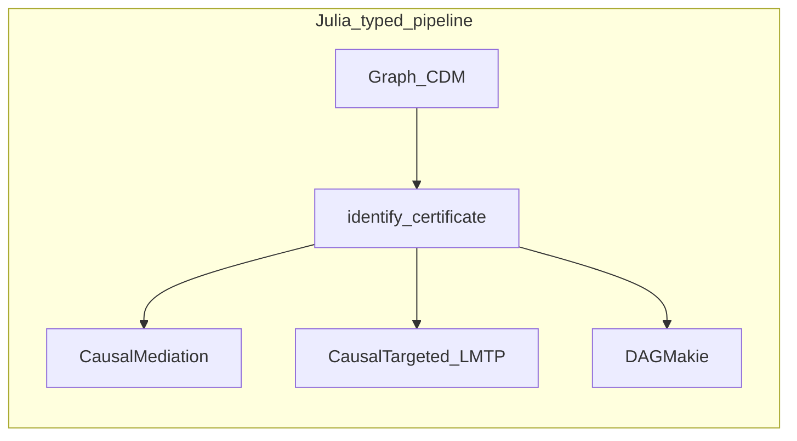

# How CausalMediation compares

CausalMediation estimates modern mediation contrasts after identification:
interventional TE / NDE / NIE under modified treatment policies, natural and
organic effects when admissible, controlled direct effects, and recanting-twin /
path-specific summaries. Intermediate confounders (`moc`) are first-class.
Super Learner, `ShiftPolicy`, and fold helpers come from
[CausalTargeted.jl](https://simonab.github.io/CausalTargeted.jl/dev/); graphs and
certificates from
[CausalDynamics.jl](https://simonab.github.io/CausalDynamics.jl/dev/).

R packages [crumble](https://cran.r-project.org/package=crumble),
[medoutcon](https://cran.r-project.org/package=medoutcon), and
[medRCT](https://cran.r-project.org/package=medRCT) are the closest conceptual
analogues (not API identity; see [Naming](naming.md)).
[Ananke](https://github.com/UH-CAnD3/ananke) covers some mediation-adjacent
targets in Python; LMTP without mediators stays in CausalTargeted / R `lmtp`.

**Choose CausalMediation when** you want Julia-native mediation with typed
`moc`, shared `IdentificationResult` hand-off, and the same Super Learner stack
as LMTP.

**Prefer `crumble` / `medoutcon` when** the analysis pipeline is already R
end-to-end, or you need a specialised option this package deliberately does not
claim (full GPU Riesz nets, every survival flavour).

Stack overview:
[ECOSYSTEM_COMPARISON.md](https://github.com/SimonAB/CausalMediation.jl/blob/main/ECOSYSTEM_COMPARISON.md).

## Legend

| Mark | Meaning |
|------|---------|
| `Yes` | First-class, documented |
| `Partial` | Possible with glue or a limited API |
| `—` | Not in that package’s usual scope |
| `Unique` | Strong differentiator here |

## Versus R and Python (mediation)

| Capability | CausalMediation | R | Python |
|------------|-----------------|---|--------|
| Interventional TE/NDE/NIE + continuous MTP | Yes | Yes (`crumble` RI, `medoutcon`) | Partial (Ananke) |
| Intermediate confounding (`moc`) | Yes | Yes (`crumble`, `medoutcon`, `medRCT`) | Partial |
| Natural effects (empty `moc`) | Yes | Yes (`crumble` `"N"`) | Partial |
| Organic effects | Yes | Yes (`crumble` `"O"`) | — |
| Recanting-twin / path-specific | Yes | Partial (`crumble` `"RT"`) | — |
| Controlled direct effect | Yes | Yes (VanderWeele / related) | Partial |
| Typed ID certificate → estimate | Unique | Partial | Partial |
| Cross-fit Super Learner (shared with LMTP) | Yes (via CausalTargeted) | Yes (sl3 + crumble) | Partial |
| LMTP without mediators | — (use CausalTargeted) | Yes (`lmtp`) | Yes (Ananke) |
| Full parity with every `crumble` option | — (deliberate) | Yes | — |

## Julia neighbours

| Package | Role |
|---------|------|
| [CausalDynamics.jl](https://simonab.github.io/CausalDynamics.jl/dev/) | `MediationQuery`, `identify`, `IdentificationResult.moc` |
| [CausalTargeted.jl](https://simonab.github.io/CausalTargeted.jl/dev/) | SL, `ShiftPolicy`, LMTP; soft mediation façades |
| [DAGMakie.jl](https://simonab.github.io/DAGMakie.jl/dev/) | Optional DAG figures |
| [TMLE.jl](https://github.com/TARGENE/TMLE.jl) | Point-treatment CM / ATE (not mediation) |

## What is distinctive here

- **Typed hand-off** — `plan_mediation` / `spec_from_identification` carry
  adjustment, mediators, and `moc` from the certificate into estimation
- **Effect families as types** — `InterventionalMediation`, `NaturalMediation`, …
  rather than opaque string brands
- **Shared nuisances with LMTP** — same lean Super Learner profiles and shift
  policies as CausalTargeted

## What we deliberately do not claim

Full parity with every option in R `crumble` / `medoutcon` (GPU Riesz nets, all
survival mediation flavours). Continuous MTP one-step uses an **outcome-residual**
augmentation of the nested-MC plugin (see [Methods](methods.md)); binary
contrasts use the fuller EIF path.

The [CDCS book](https://simonab.github.io/causal-dynamics-book/) walks identify →
estimate → display end to end.
